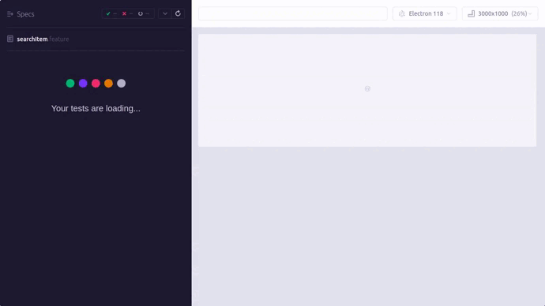

# Amazon Automation

This project automates the process of selecting a different dropdown option from the department menu during a search on Amazon.com using Cypress. The test script randomly selects a dropdown option in each test run, ensuring thorough coverage of department selections.

## Folder Structure Overview

- **e2e/**: Test files grouped by module and feature.
- **fixtures/**: Contains static data used by tests.
- **helpers/**:  Contains folder that stores all the helpers function that can be used globally.
- **pages/**: Contains actual page classes that interact with UI elements.
- **page_objects/**: Contains logical parts of page objects.
- **support/**: Support files like commands and custom assertions.
- **cypress.config.json**: Cypress configuration file.

## Setup

### Running Locally

### Prerequisites

- Node.js
- Cypress

### Installation

1. Clone the repository:

   ```bash
   git clone https://github.com/roshikab/amazon_automation 
   ```

2. Install dependencies:

   ```bash
   npm install
   ```

3. You can run the Cypress automation locally to test or make adjustments:

   ```
   npx cypress open
   npx cypress run
   ```
### Automation in Action
